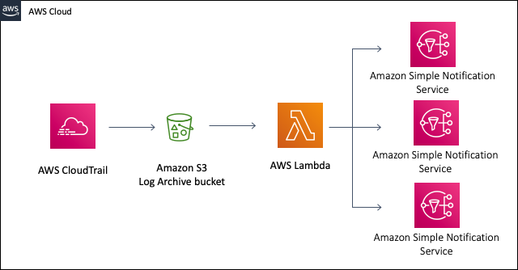

# s3-to-multiple-sns

## Enabling and configuring multiple event notifications for an S3 Bucket
We can enable certain Amazon S3 events to send a notification message to a destination whenever the events occur.

Challange is to configure the multiple SNS as s3 event

* Solutions!!

